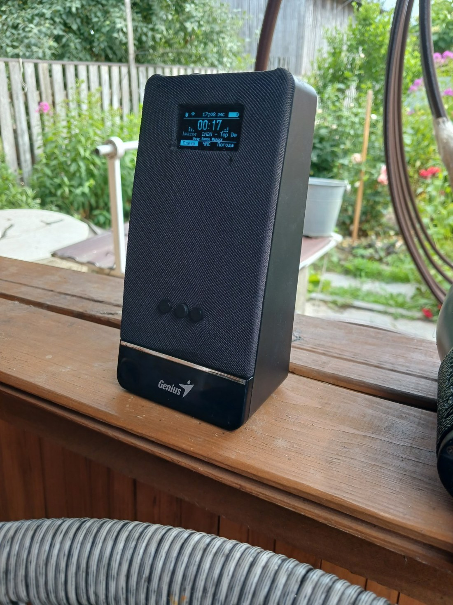
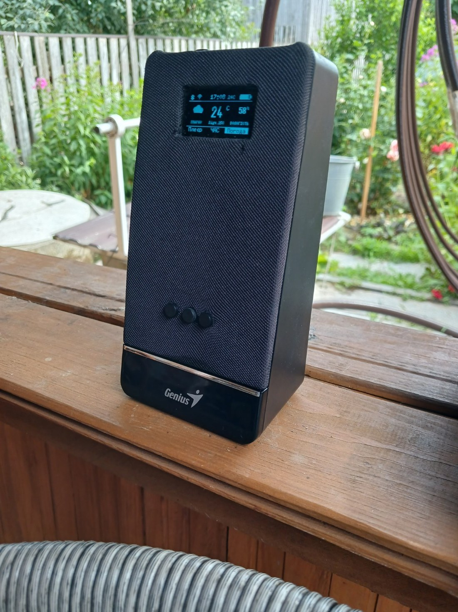
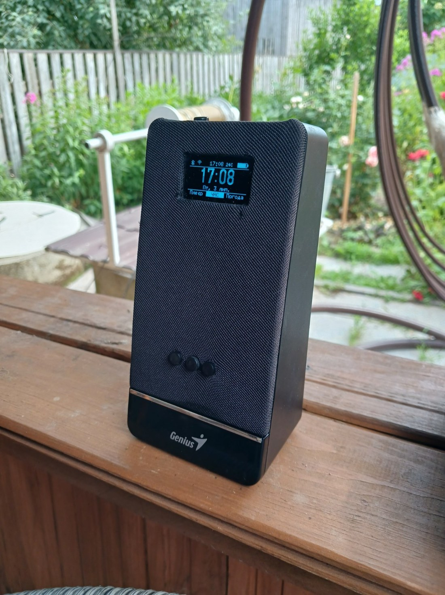
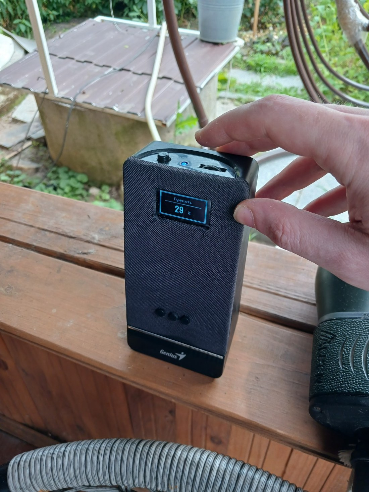
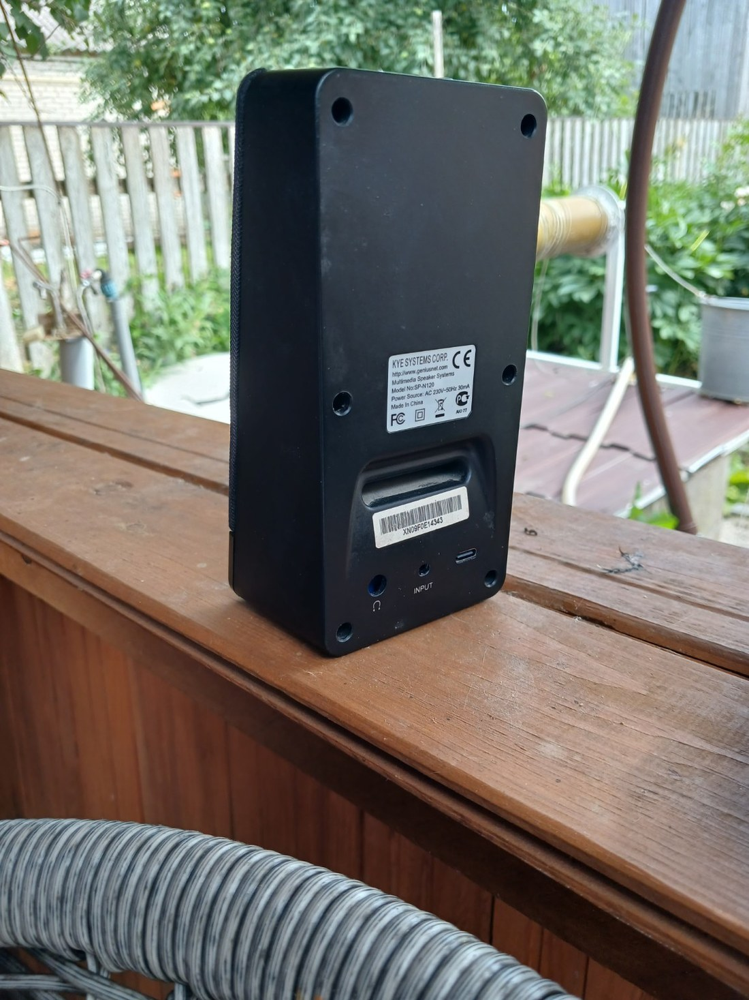

# OLED BT Speaker — ESP32 Bluetooth Speaker with 128×64 OLED UI

A DIY ESP32 Bluetooth speaker firmware with a small 128×64 OLED interface, local configuration portal, battery/charging telemetry, a physical volume knob, weather/clock/player screens, and a tiny sleeping-kitty idle screen.

The project is built around an ESP32 board, a MAX98357A I2S amplifier module, and a monochrome 128×64 OLED display. The current firmware line is the stable v3.5 release candidate used in a real rebuilt desktop speaker enclosure.

## Gallery

| Player UI | Weather UI | Clock UI |
|---|---|---|
|  |  |  |

**| Volume overlay | Back panel |** 
|---|---|
|  |  |
## Features

- Bluetooth Classic A2DP audio sink.
- I2S audio output to MAX98357A.
- 128×64 OLED UI with Player, Clock, Weather, volume overlay, and sleep screen.
- Player screen with metadata, elapsed timer, status icons, and brick-style EQ visualization.
- Weather screen with OpenWeather data, temperature, humidity, day/night icon handling, and NTP time sync.
- Battery voltage, USB/VBUS detection, charging indicator, and calibrated battery percentage.
- Physical volume potentiometer with smoothing/deadband.
- Local AP configuration portal for Wi-Fi, weather, Bluetooth name, welcome text, and portal credentials.
- Runtime language selection/reset flow.
- Sleep screen with a monochrome pixel-art sleeping kitty and animated Z symbols.

## Hardware used in the reference build

- ESP32 / LoLin-style board.
- OLED 128×64 I2C display.
- MAX98357A I2S amplifier.
- 1S Li-ion battery pack.
- USB/VBUS sense divider.
- Battery voltage divider.
- Physical potentiometer on GPIO35 for volume control.
- Three front buttons for Player / Clock / Weather navigation.
- Reused small desktop speaker enclosure.

## Pinout

### OLED

| Signal | GPIO |
|---|---:|
| SDA | 23 |
| SCL | 22 |

### MAX98357A / I2S audio

| Signal | GPIO |
|---|---:|
| BCLK | 26 |
| LRC / WS | 25 |
| DIN | 32 |

### Battery / USB / volume

| Function | GPIO | Notes |
|---|---:|---|
| Battery voltage ADC | 34 | 100k/100k divider in the reference build |
| USB/VBUS sense | 33 | 100k/100k divider in the reference build |
| Volume potentiometer | 35 | Wiper to GPIO35, end terminals to 3.3V/GND |

See [`docs/pinout.md`](docs/pinout.md) for the current detailed wiring notes.

## Configuration portal

Hold the **Clock** button while resetting/powering the device to start the local setup portal.

Default setup mode:

- AP SSID: `OLED-SETUP`
- URL: `http://192.168.4.1`
- Username: `BTAdmin`
- Password: `BTPassword`

Portal fields:

- Wi-Fi SSID
- Wi-Fi password
- OpenWeather API key
- Location, for example `Kyiv,UA`
- Bluetooth device name
- Welcome screen text
- Portal username
- Portal password

Change the default portal password after first setup if the device will be used outside a private test environment.

## Default config placeholders

`src/00_config.h` intentionally contains public-safe placeholders. Real Wi-Fi credentials and API keys should be entered through the configuration portal or kept in a private local build only.

## Build notes

Reference toolchain seen during development:

- Arduino IDE / ESP32 board package.
- Board target: `ESP32 Dev Module`.
- ESP32-A2DP library.
- AudioTools library.
- U8g2 library.
- ArduinoJson library.

Open `OLED_BT_Speaker_LoLin.ino` in Arduino IDE, select an ESP32 board target, install the required libraries, and upload to the board.

## Important audio note

The current audio path is intentionally conservative and should not be changed casually. The stable reference path uses the AudioTools / ESP32-A2DP baseline with mono downmix and controlled volume. Earlier I2S/stream-reader experiments were intentionally abandoned because they broke or degraded audio on the real device.

## Current release status

The current public release candidate includes:

- Config storage and neutral runtime configuration.
- Runtime wiring through `speakerConfig`.
- Local AP configuration portal.
- Battery calibration and volume-pot smoothing.
- Sleep kitty OLED idle screen.

See [`RELEASE_NOTES.md`](RELEASE_NOTES.md) for the release history.

## Known future work

- Boot-time factory reset confirmation flow that wipes all config and starts the portal.
- Optional boot picker / SD firmware loader concept.
- Track timer reset on repeat, if AVRCP/timer behavior allows it cleanly.
- Optional service/programming connector polish for enclosed builds.

## License

No formal license has been selected yet. Add one before publishing if you want others to reuse the code under clear terms.
